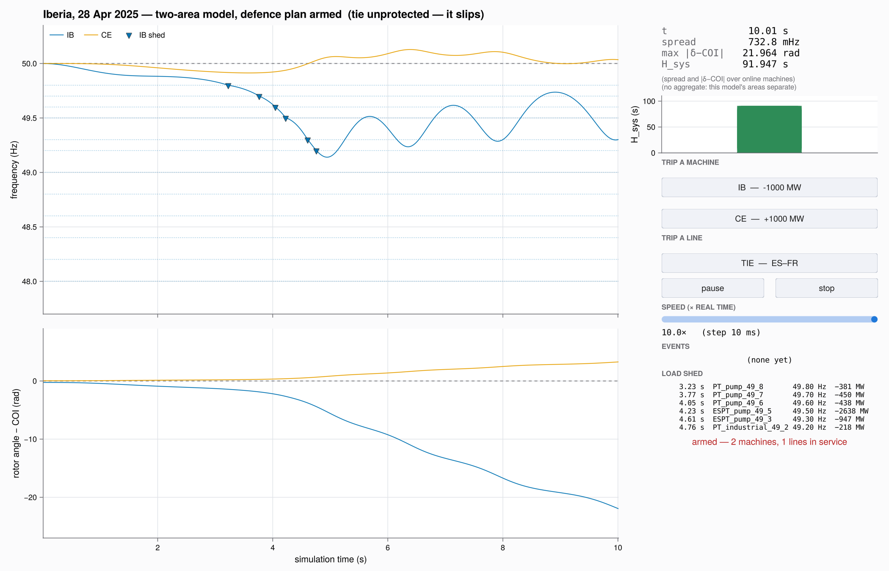
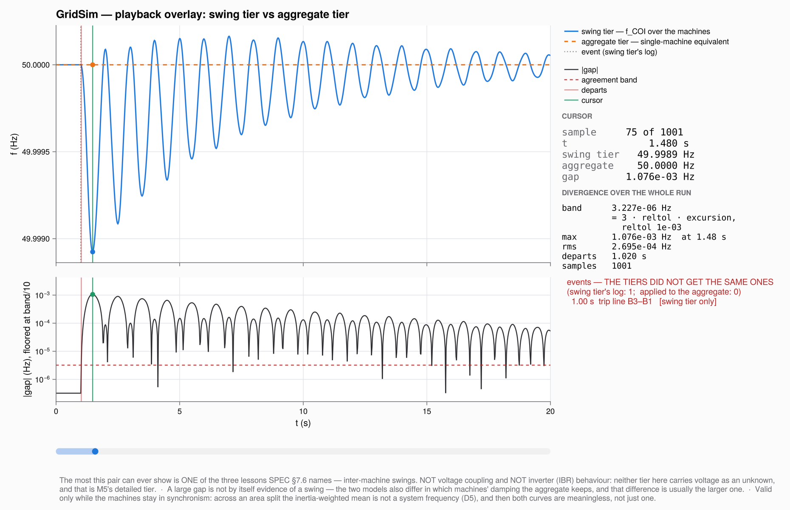

# GridSim

A power-grid simulator in Julia that starts as a tiny, correct frequency-response
model and grows toward a full energy-system simulator — generators, transmission,
dynamics, protection, renewables, and markets — at multiple fidelities behind one
engine interface.

It is a **personal instrument for learning power systems by experiment**: stand on
the mature Julia ecosystem (`DifferentialEquations.jl`, `NetworkDynamics.jl`, the
NREL-Sienna stack where it fits) and build only the bespoke part — the orchestration
layer that steps models in wall-clock time, injects live perturbations, and routes
between fidelity tiers.

> **Status: Milestones 1–3 landed; Milestone 4 in progress.** Two fidelity tiers
> exist behind one interface — an aggregate centre-of-inertia frequency model (M1)
> and a multi-machine network swing model (M2) with governor droop, low-frequency
> load shedding, out-of-step tie protection and scheduled generation ramps (M3) —
> both drivable live (`run_realtime!`) and, since M4 step 1, offline
> (`solve!`). Both have GLMakie windows. The 28 April 2025 Iberian blackout is the
> standing real test case, on both tiers. The milestone map and what each one
> found is [`docs/plans/README.md`](docs/plans/README.md); the durable brief is
> [`docs/SPEC.md`](docs/SPEC.md).

## Design in one breath

- **Headless core, single process.** The core (`src/`) is a library with *zero* UI
  dependency, drivable from the REPL / a script. The UI (`ui/`) depends on the
  core, never the reverse — enforced by a dependency-closure test, not convention.
  No client/server, no sockets.
- **Fidelity tiers + a mode router.** Every phenomenon gets a fast surrogate (run
  in real time) and an accurate sibling (run offline, then played back). Which mode
  you get slides with system size.
- **One canonical model.** The aggregate model is *compiled down* from the network
  model (`coi_model`), never hand-maintained beside it.
- **Validation-first.** Every mechanism carries a label saying what checks it — a
  closed form, a cross-fidelity comparison, a published case, or an honest
  "un-oracled". The ledger is [`docs/validation-ledger.md`](docs/validation-ledger.md).
  *Seeing where the cheap model diverges from the accurate one is the lesson*, and
  `divergence` in `src/analysis/postprocess.jl` is how that is read.

## What you can do today

- Trip a generator on a small system **while it runs** and watch frequency, RoCoF
  and nadir live; see that less inertia ⇒ steeper RoCoF, deeper nadir.
- Run a multi-machine ring, trip a line or a machine, watch the rotor angles swing
  against the centre of inertia, and see a defence plan shed load at root-found
  instants.
- Replay the Iberian event on the aggregate tier (`scripts/iberia_2025_04_28.jl`)
  and see exactly where that tier stops being faithful; then run the two-area
  version (`scripts/iberia_two_area.jl`) and sweep the tie strength to see what
  survives the sweep and what was an artefact of one cell.
- Solve a scenario offline (`solve!`) onto a chosen output grid and compare it,
  channel by channel, against the real-time run or against the other tier.

## Getting started

Requires Julia ≥ 1.10 (install via [juliaup](https://github.com/JuliaLang/juliaup)).

```julia
# from the repo root
julia --project=. -e 'import Pkg; Pkg.instantiate(); using GridSim; println(example_system())'

# run the core tests (no screen needed)
julia --project=. -e 'import Pkg; Pkg.test()'

# the aggregate-tier Iberian replay, headless
julia --project=. scripts/iberia_2025_04_28.jl
```

A first experiment, offline, both tiers on one grid:

```julia
using GridSim
net = three_machine_ring()
sw  = SwingEngine(net)                              # network swing tier
fr  = FrequencyResponseEngine(coi_model(net))       # aggregate tier, compiled from it
ev  = [1.0 => TripGenerator(:G1)]
a = solve!(sw, (0.0, 20.0); perturbations = ev, saveat = 0.02)
b = solve!(fr, (0.0, 20.0); perturbations = ev, saveat = 0.02)
band = tolerance_band(a.f_coi; reltol = 1e-3)      # stated BEFORE looking at the gap
divergence(a, b; band = band)                       # (; max, t_max, rms, t_depart, n)
```

The UI is a separate environment; see [`ui/README.md`](ui/README.md) for setup,
the three windows, and offscreen rendering.

## What it looks like

Every figure below is a frame of the same window a user opens, rendered
offscreen by the scripts in `ui/scripts/` — never a separate "figure" code path.

The 28 April 2025 Iberian separation on the two-area swing tier, defence plan
armed and annotated at the instants each stage fired (report Figure 3-67):



The playback overlay — the network swing tier against the aggregate tier compiled
from the same model, on the line trip where the gap between them *is* the
inter-machine swing content:



## Repository layout

```
GridSim/
├── Project.toml          # core package — does NOT depend on Makie
├── src/
│   ├── GridSim.jl        # module root, exports
│   ├── model/            # SystemModel (aggregate) and NetworkModel (canonical); coi_model
│   ├── engines/          # SimulationEngine interface, recorder, playback driver, two engines
│   ├── events/           # perturbation event types (TripGenerator, StepLoad, TripLine)
│   ├── protection/       # armed, state-triggered schemes: load shedding, out-of-step
│   ├── scenarios/        # scheduled inputs: generation ramps
│   ├── analysis/         # post-processing: windowed RoCoF, cross-run divergence
│   └── orchestration/    # real-time loop, event queue, pacing, Observables (no UI import)
├── test/                 # one suite: closed-form, cross-fidelity and control checks
├── scripts/              # headless experiments; the two Iberian replays
├── ui/                   # separate package: `using GridSim`, `using GLMakie`; two windows
└── docs/
    ├── SPEC.md           # the durable brief (architecture invariants, conventions)
    ├── validation-ledger.md  # every mechanism and what checks it
    ├── plans/            # per-milestone plan / context / tasks trios, and the index
    └── scenarios/        # extracted ENTSO-E data with page citations
```

## License

[BNCL-1.0](LICENSE) (Boyko Non-Commercial License v1.0) © 2026 Boyko Neov
